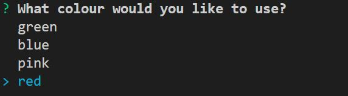

# Developer-Profile-Generator
Assignment 8

##Objective

This project is a command-line application that dynamically generates a PDF profile from a GitHub username. 

##Solution

 * The user will be prompted for a their GitHub username

 * Nest the user will be propted for their favorite color, which will be used as the background color for cards.

The PDF will be populated with the following:

* Profile image
* User name
* Links to the following:
  * User location via Google Maps
  * User GitHub profile
  * User blog
* User bio
* Number of public repositories
* Number of followers
* Number of GitHub stars
* Number of users following

All infomation was used using the GitHub API (https://api.github.com/users/)

 * After the PDF is create it will output in the same directory but it will be called the users full name without a space .pdf

* The final product will be a pdf will all the above requirements and will have the colour scheme the user pick.

